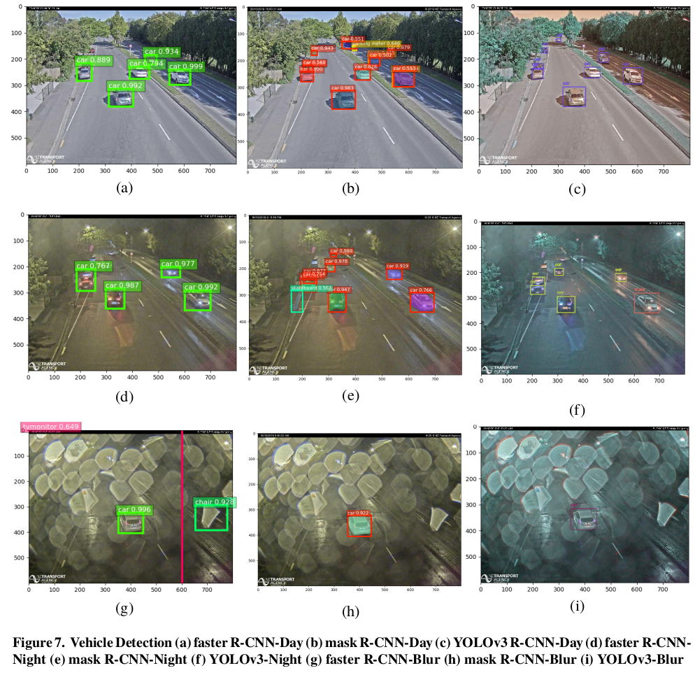
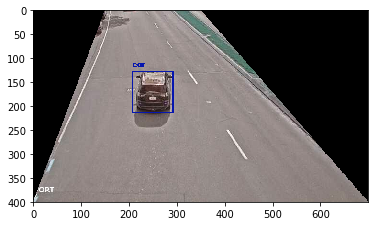

# Traffic-Flow-Estimation

Emergency Traffic Management (ETM) is one of the main problems in smart urban cities. This project focuses on selecting an appropriate object detection model for identifying and counting vehicles from closed-circuit television (CCTV) images and then estimating traffic flow as the first step in a broader project. Therefore, a case is selected at one of the busiest roads in Christchurch, New Zealand. Two experiments were conducted in this research:

1) to evaluate the accuracy and speed of three famous object detection models namely faster R-CNN, mask R-CNN and YOLOv3 for the data set.

2) to estimate the traffic flow by counting the number of vehicles in each of the four classes such as car, bus, truck and motorcycle. A simple Region of Interest (ROI) heuristic algorithm is used to classify vehicle movement direction such as “left-lane” and “right-lane”.

